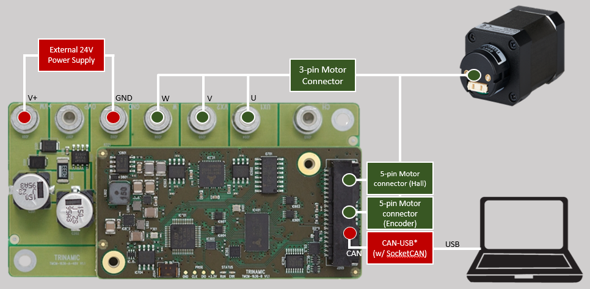
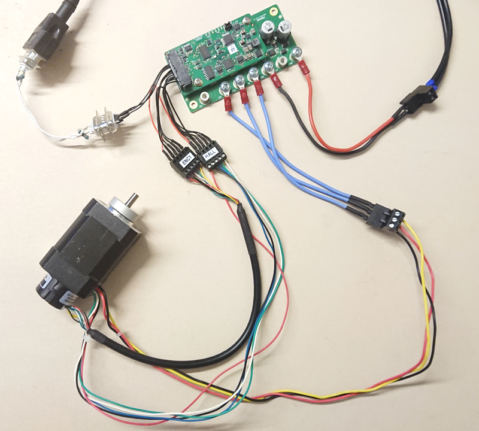
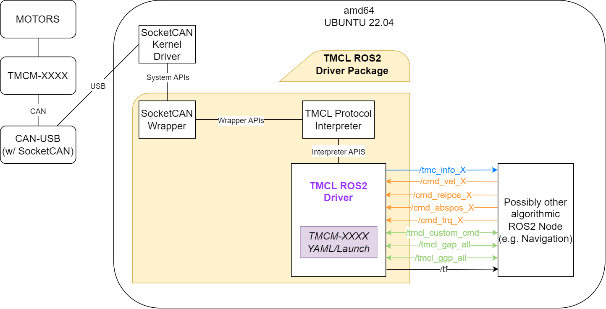

| tmcl_ros2 |
| --- |
Official ROS2 Driver for Trinamic Motor Controllers (TMC) that uses Trinamic Motion Control Language (TMCL) protocol. |

# Background
- Supported TMC boards: [TMCM-1636](https://www.trinamic.com/products/modules/details/tmcm-1636/), [TMCM-1617](https://www.trinamic.com/products/modules/details/tmcm-1617/), [TMCM-1241](https://www.trinamic.com/products/modules/details/tmcm-1241/), [TMCM-1260](https://www.trinamic.com/products/modules/details/tmcm-1260/), [TMCM-6214](https://www.trinamic.com/products/modules/details/tmcm-6214/)
- Supported communication interface and interface driver: CAN (SocketCAN)
- Supported ROS2 and OS distro: Humble (Ubuntu 22.04)
- Supported platform: Intel x86 64-bit (amd64)
- Supported setup: Single/Multiple TMC in Single/Multiple CAN channel (namespace-managed)

> :memo: _Note: Although officially supported TMC boards are only the abovementioned, all market-ready TMCs with YAMLs in this repository are also expected to work and can be tried and tested by the users._
> _Contact the Developers for any  issues encountered._

# Hardware

For the tested TMCM-1636 setup, the following are used:
- 1 x [TMCM-1636](https://www.trinamic.com/products/modules/details/tmcm-1636/)
- 1 x [QBL4208-61-04-013 BLDC motor](https://www.trinamic.com/products/drives/bldc-motors-details/qbl4208/)
- 1 x External 24V power supply
- 1 x CAN USB Cable (w/SocketCAN support) - with 120 ohm termination resistors

Also the following:
- PWR/GND from board to external 24V power supply
- 5-pin Motor connector (Hall) (see _Note_ below)
- 5-pin Motor connector (Encoder) (see _Note_ below)
- 40 pin Molex connectors

> :memo: _Note: Check Section 4 of [QBL4208-x-1k Datasheet](https://www.trinamic.com/fileadmin/assets/Products/Motors_Documents/QBL4208-x-1k_datasheet_Rev1.40.pdf) for motor wiring references._

The image below shows the connection diagram of the setup (with labels):


The image below shows the actual setup used (for reference):


# Software

## Software Architecture


## Software Dependencies
Assumptions before building this package:
* Installed ROS2 Humble. If not, follow these [steps](https://docs.ros.org/en/humble/Installation/Ubuntu-Install-Debians.html).
* Setup workspace (with workspace folder named as "ros2_ws"). If not, follow these [steps](https://docs.ros.org/en/humble/Tutorials/Beginner-Client-Libraries/Creating-A-Workspace/Creating-A-Workspace.html).

# Clone

In the website:
1. Make sure that the branch dropdown is set to "humble".
2. Click the "Clone" or "Code" button, then copy the SSH or HTTPS link (eg, "*.git").

In a terminal, do the following:
```bash
$ cd ~/ros2_ws/src
$ git clone <copied SSH o HTTPS link here> tmcl_ros2  #clones repo to "tmcl_ros2" directory name
```
# Build

```bash
########## [TERMINAL 1] ##########
# Do proper exports first:
## $ source /opt/ros/<ROS2 Version>/setup.bash
$ source /opt/ros/humble/setup.bash 

# Resolve any dependencies
$ cd ~/ros2_ws
$ rosdep install -i --from-path src --rosdistro humble -y

# Build
$ colcon build
## To clean first before building, you may run the following instead:
## $ colcon build --cmake-clean-first

```
> :memo: _Note: It is recommended that 1 terminal is dedicated to building the package/workspace to avoid complex issues as mentioned in [ROS2 Source the overlay](https://docs.ros.org/en/humble/Tutorials/Beginner-Client-Libraries/Creating-A-Workspace/Creating-A-Workspace.html#source-the-overlay)_

# Pre-Launch (One-time per setup)

If it's the first time to use the set of motors for the TMC that you are using, it is required to calibrate and tune the PID settings of the motors first.

Do the calibrations/tuning by downloading and using [TMCL-IDE](https://www.trinamic.com/support/software/tmcl-ide/).

## BLDC Motors
### Calibrate the motors

For a run-through/tutorial of how the calibration is done in the TMCL-IDE via its `Wizard Pool` feature, check this [link](https://www.youtube.com/watch?v=MASVD_2tNuo).

### Tune the PI settings of the motors

For a run-through/tutorial of how the PI tuning is done in the TMCL-IDE via its `PI Tuning` feature, check this [link](https://www.youtube.com/watch?v=rfZAs-QdYlQ).

> :memo: _Note: For all the calibration and tuning done, store all the parameters set from TMCL_IDE on the board's EEPROM. Do this by doing any of the following:_
> - _Clicking the "Store Parameter" under Settings of each axis_
> - _Using STAP (Store Axis Parameters) command from Direct Mode_
> - _Creating and uploading a TMCL Program, and enabling the "auto start mode" under SGP (Set Global Parameter) command from Direct Mode_
> - - :memo: _Note: Some boards don't have "auto start mode", so in such a case, use the other options to store the parameters._

## Stepper Motors

### Calibrate the motors

For a run-through/tutorial of how the calibration is done in the TMCL-IDE via its `Wizard Pool` feature, check this [link](https://www.youtube.com/watch?v=l6r63Q7Yr58o).

For more information about Trinamic features on stepper motors, visit this [link](https://www.trinamic.com/technology/motor-control-technology/).

> :memo: _Note: For all the calibration and tuning done, store all the parameters set from TMCL_IDE on the board's EEPROM. Do this by:_
> - _Creating and uploading a TMCL Program, and enabling the "auto start mode" under SGP (Set Global Parameter) command from Direct Mode_

# Pre-Launch (One-time)

## Initialize CAN

> :memo: _Note: This script automatically brings-up CAN upon boot. Do this step only once._

To proceed, first make the script executable (do this only once as this change persists even after power-off):
```bash
$ cd ~/ros2_ws/src/tmcl_ros2/scripts
$ chmod +x CAN_init.sh
```

Execute the script:
```bash
# To know more about the usage
$ sudo ./CAN_init.sh -h
# Usage
$ sudo ./CAN_init.sh -i <communication interface name> -b <bitrate>
# Example: can0 as communication interface name and 1000KBPS bitrate
$ sudo ./CAN_init.sh -i can0 -b 1000000
```
Where:
- CAN communication interface name is the interface used between the PC and the TMC _(accepted values: can0 - can255)_
- bitrate is the rate of communication interface _(accepted values: 20000, 50000, 100000, 125000, 250000, 500000, 1000000)_

> :memo: _Note: The above mentioned accepted values are a range, though the user still needs to check the actual TMC's datasheet on the applicable range._
> _Additionally, the bitrate set here must be the same bitrate set into the the TMC as the Global Parameter "CAN bit rate"._

## De-initialize CAN

> :memo: _Note: This script disables the automatic bring-up of CAN upon boot._

To proceed, first make the script executable (do this only once as this change persists even after power-off):
```bash
$ $ cd ~/ros2_ws/src/tmcl_ros2/scripts
$ chmod +x CAN_deinit.sh
```

Execute the script:
```bash
# To know more about the usage
$ sudo ./CAN_deinit.sh -h
# Usage
$ sudo ./CAN_deinit.sh -i <communication interface name>
# Example: can0 as communication interface name
$ sudo ./CAN_deinit.sh -i can0
```
Where:
- communication interface is the interface used between the PC and the TMC _(accepted values: can0 - can255)_


# Launch
```bash
########## [TERMINAL 2] ##########
# Do proper exports first:
$ cd ~/ros2_ws
$ source install/setup.bash

# Launch
$ ros2 launch tmcl_ros2 tmcm_1636.launch.py

# Launch with DEBUG logs
$ ros2 launch tmcl_ros2 tmcm_1636.launch.py log_level:=DEBUG
```
> :memo: _Note: This should be a different terminal from the one you used when building to avoid complex issues as mentioned in [ROS2 Source the overlay](https://docs.ros.org/en/humble/Tutorials/Beginner-Client-Libraries/Creating-A-Workspace/Creating-A-Workspace.html#source-the-overlay)_
# Nodes

## tmcl_ros2_node

> :memo: _Note: For those with <motor_num> in the topic names, these are ideally the motor number. For example, if there are 2 motors used, there should be two published topics for tmc_info, specifically /tmc_info_0 for motor 0 and then /tmc_info_1 for motor 1._

### Published topics

These are the default topic names, topic names can be modified as a ROS parameter.

+ **/tmc_info_\<motor_num\>** (tmcl_ros2/msg/TmcInfo)
    - Data containing:
      + (1) board voltage (V)
      + (2) statusflag value (only for boards with StatusFlags AP, else, value is set to 0)
      + (3) statusflag notifications (only for boards with StatusFlags AP and StatusFlags Register names). In the case of Stepper motor(s), this publishes driver error flags and extended error flags values. Else, value is set to " ")
      + (4) motor number
      + (5) velocity (if [Parameter](#parameters) wheel_diameter is set to 0, the unit for published velocity is rpm, else m/s)
      + (6) position (degree angle)
      + (7) torque (mA)

### Subscribed topics

+ **/cmd_vel_\<motor_num\>** (geometry_msgs/msg/Twist)
    - Velocity command (rpm or m/s)
+ **/cmd_abspos_\<motor_num\>** (std_msgs/msg/Int32)
    - Absolute position command (degree angle)
+ **/cmd_relpos_\<motor_num\>** (std_msgs/msg/Int32)
    - Relative position command (degree angle)
+ **/cmd_trq_\<motor_num\>** (std_msgs/msg/Int32)
    - Torque command (mA)

### Advertised services

+ **/tmcl_custom_cmd** (tmcl_ros2/srv/TmcCustomCmd)
    - Executes a custom SAP, GAP, SGP and GGP commands
    - The output contains raw data (velocity = rpm, position = units) from the board. *Do not expect same unit from the publisher.*
+ **/tmcl_gap_all** (tmcl_ros2/srv/TmcGapAll)
    - Get all Axis Parameter values
+ **/tmcl_ggp_all** (tmcl_ros2/srv/TmcGgpAll)
    - Get all Global Parameter values

### Parameters

> :memo: _Notes:_
> - _If any of these parameters are not set/declared, default values will be used._
> - _To know more details about each parameter, you can execute `$ ros2 param describe <node> <parameter>`_

##### _Communication Interface Parameters_

+ **comm_interface** (int, default: 0)
    - Interface used between the PC and the TMC (where 0 = CAN)
+ **comm_interface_name** (string, default: can0)
    - Name of the interface or device as detected by the PC
+ **comm_tx_id** (int, default: 1)
    - ID for board TX
+ **comm_rx_id** (int, default: 2)
    - ID for board RX

##### _TMC ROS Node Parameters_

+ **comm_timeout_ms** (int, default: 10)
    - Indicates how long should the node will wait for the rx data
+ **comm_exec_cmd_retries** (int, default: 1)
    - Indicates how many the node will retry sending data before shutting down if no data received
+ **adhoc_mode** (bool, default: false)
    - This mode expects that the used module is not known. The velocity, position and torque relies on the additional_ratio_* values.
+ **en_motors[]** (int array, default: [0])
    - Enables/disables active motors or axes. If disabled, settings for those motors will be ignored or not set.
+ **auto_start_additional_delay** (int, default: 0)
    - Added delay in seconds if auto start mode is enabled. Use this if your TMCL program needs to start running after over 2 seconds.

##### _Motor Configuration Settings_
> :memo: _Notes:_
> - _The following parameters can be provided for each motor, otherwise default will be used._
> - _Resulting parameter will be prefixed by `motor<motor_num>.` (e.g. `motor0.en_pub_tmc_info`)_

+ **en_pub_tmc_info** (bool, default: true)
    - Enables/disables publishing of TMC information
+ **pub_rate_tmc_info** (int, default: 10)
    - Publish rate (hertz) of TMC information
+ **pub_actual_vel** (bool, default: false)
    - Enable/Disable actual velocity that the user can optionally publish every publish rate as long as en_pub_tmc_info is true
+ **pub_actual_trq** (bool, default: false)
    - Enable/Disable actual torque that the user can optionally publish every publish rate as long as en_pub_tmc_info is true
+ **pub_actual_pos** (bool, default: false)
    - Enable/Disable actual position that the user can optionally publish every publish rate as long as en_pub_tmc_info is true
+ **tmc_info_topic** (string, default: /tmc_info_<motor_number>)
    - tmc_info topics that will contain chosen TMC info that will be published
+ **tmc_cmd_vel_topic** (string, default: /cmd_vel_<motor_number>)
    - Twist topics that will be the source of target velocity to be set on the TMC
+ **tmc_cmd_abspos_topic** (string, default: /cmd_abspos_<motor_number>)
    - Int32 topics that will be the source of target position to be set on the TMC
+ **tmc_cmd_relpos_topic** (string, default: /cmd_relpos_<motor_number>)
    - Int32 topics that will be the source of target position to be set on the TMC
+ **tmc_cmd_trq_topic** (string, default: /cmd_trq_<motor_number>)
    - Int32 topics that will be the source of target torque to be set on the TMC
+ **wheel_diameter** (double, default: 0.0)
    - Wheel diameter that is attached on the motor shaft directly. This is to convert linear values to rpm
    - If wheel diameter is 0.0, cmd_vel is equal to rpm
+ **additional_ratio_vel** (double, default: 1.0)
    - Additional Ratio for velocity for general purposes (adhoc mode, added pulley or gear trains). Default value 1.0 means disabled
+ **additional_ratio_pos** (double, default: 1.0)
    - Additional Ratio for position for general purposes (adhoc mode, added pulley or gear trains). Default value 1.0 means disabled
+ **additional_ratio_trq** (double, default: 1.0)
    - Additional Ratio for torque for general purposes (adhoc mode). Default value 1.0 means disabled 

# Quick Tests

### Test Velocity Mode

To do a quick test of Velocity Mode, there is a fake velocity script that the user can run.
Idea is, this script will send Velocity commands (as a ROS topic), then the first motor should be expected to:
1. Increase velocity every 3secs, clockwise (in m/s: 3, 6, 9)
2. Stop for 5secs
3. Increase velocity every 3secs, counter-clockwise (in m/s: -3, -6, -9)
4. Stop for 5secs

To proceed with the test, execute these following commands on three (3) different terminals (in sequence):
> :memo: _Note: Assuming that the package was [built](#build) in Terminal 1 and [Initialize CAN](#initialize-can) is already done on Terminal 1._

| Terminal 2 | Terminal 3  | Terminal 4 |
--- | --- | ---|
|<pre>$ cd ~/ros2_ws/ <br>$ source /opt/ros/humble/setup.bash <br>$ source install/setup.bash <br>$ ros2 launch tmcl_ros2 tmcm_1636.launch.py  | <pre>$ cd ~/ros2_ws/ <br>$ source /opt/ros/humble/setup.bash <br>$ source install/setup.bash <br>$ ros2 topic echo /tmc_info_0 | <pre>$ cd ~/ros2_ws/src/tmcl_ros2/scripts <br>$ sudo chmod 777 fake_cmd_vel.sh <br>$ ./fake_cmd_vel.sh |

**Monitor the velocity of the first motor (watch out for velocity value at Terminal 3).**

> :memo: _Notes:_
> - _Terminals 3 and 4 are best viewed side-by-side._
> - _You may Ctrl-C the command in Terminal 2 and 3 once you're done._
> - _The command in Terminal 4 auto-stops by itself._

### Test Position Mode
To do a quick test of Position Mode, there is a fake position script that the user can run.
Idea is, this script will send Position commands (as a ROS topic), then the first motor should be expected to:
1. Rotate 360 degrees (clockwise) every 5 secs, 3 times
2. Stop for 5secs
3. Rotate 360 degrees (counter-clockwise) every 5 secs, 3 times
4. Stop for 5secs

To proceed with the test, execute these following commands on three (3) different terminals (in sequence):
> :memo: _Note: Assuming that the package was [built](#build) in Terminal 1 and [Initialize CAN](#initialize-can) is already done on Terminal 1._

| Terminal 2 | Terminal 3  | Terminal 4|
--- | --- | ---|
|<pre>$ cd ~/ros2_ws/ <br>$ source /opt/ros/humble/setup.bash <br>$ source install/setup.bash <br>$ ros2 launch tmcl_ros2 tmcm_1636.launch.py  | <pre>$ cd ~/ros2_ws/ <br>$ source /opt/ros/humble/setup.bash <br>$ source install/setup.bash <br>$ ros2 topic echo /tmc_info_0 | <pre>$ cd ~/ros2_ws/src/tmcl_ros2/scripts <br>$ sudo chmod 777 fake_cmd_pos.sh <br>$ ./fake_cmd_pos.sh |

**Monitor the position of the first motor (watch out for position value at Terminal 3).**

> :memo: _Notes:_
> - _Terminals 3 and 4 are best viewed side-by-side._
> - _You may Ctrl-C the command in Terminal 2 and 3 once you're done._
> - _The command in Terminal 4 auto-stops by itself._

### Test Torque Mode
To do a quick test of Torque Mode, there is a fake torque script that the user can run.
Idea is, this script will send Torque commands (as a ROS topic), then the first motor should be expected to:
1. Rotate for 5 secs, with torque = 300
2. Stop for 5secs
3. Rotate for 5 secs again, with torque = 300

To proceed with the test, execute these following commands on three (3) different terminals (in sequence):
> :memo: _Note: Assuming that the package was [built](#build) in Terminal 1 and [Initialize CAN](#initialize-can) is already done on Terminal 1._

| Terminal 2 | Terminal 3  | Terminal 4|
--- | --- | ---|
|<pre>$ cd ~/ros2_ws/ <br>$ source /opt/ros/humble/setup.bash <br>$ source install/setup.bash <br>$ ros2 launch tmcl_ros2 tmcm_1636.launch.py  | <pre>$ cd ~/ros2_ws/ <br>$ source /opt/ros/humble/setup.bash <br>$ source install/setup.bash <br>$ ros2 topic echo /tmc_info_0 | <pre>$ cd ~/ros2_ws/src/tmcl_ros2/scripts <br>$ sudo chmod 777 fake_cmd_trq.sh <br>$ ./fake_cmd_trq.sh |

**Monitor the torque of the first motor (watch out for torque value at Terminal 3).**

> :memo: _Notes:_
> - _Terminals 3 and 4 are best viewed side-by-side._
> - _You may Ctrl-C the command in Terminal 1 and 2 once you're done._
> - _The command in Terminal 4 auto-stops by itself._

# Limitations
1. No support for interfaces other than CAN yet.

# Support

Please contact the `Maintainers` if you want to use this ROS Driver on Trinamic Motor Controllers without YAML files in this repository.

Any other inquiries and support are also welcome.
